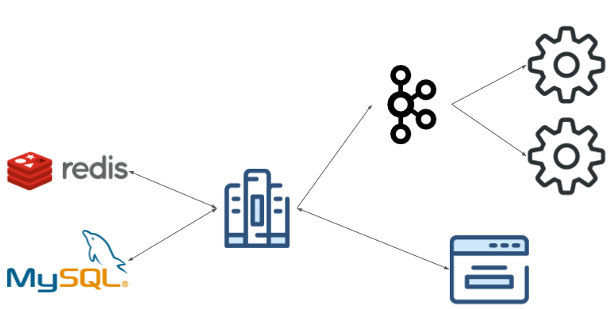

# eLibrary

Online book store project. Visit it [eLibrary](https://elibrary-2019.herokuapp.com).

## Features

- Register/Login through (OAuth) `Facebook`, `Gmail` account
- Search/Sort/Collect books
- Payment flow (`Braintree`(SandBox))
- I18n supported  (`en` / `ja` / `zh-tw`)

## Struct Sketch Map



## Start Project

- Environment Preparation

```shell
pip3 install -r requirements.txt

python3 manage.py migrate

python3 manage.py collectstatic
```

- Start Server
  - Run on `LOACL`:

  ```shell
  python3 manage.py runserver
  ```

  - Run on `PROD`:

  ```shell
  gunicorn --timeout=30 --workers=4 eLibrary.wsgi:application
  ```

## Test Project

- Unittest

```shell
python3 manage.py test
```

- Integration Test

  - Normal User Account
    - username: `test_guest`
    - password: `test_guest`

  - `Braintree` Test Credit Card
    - card number: `4111 1111 1111 1111`
    - expiration date: `02/22`
